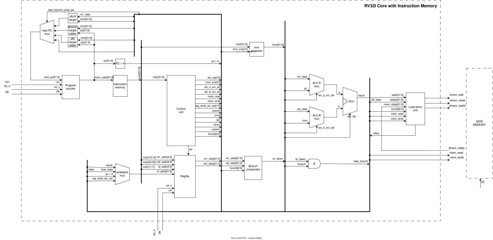

# RV32I Single-Cycle Core

[](https://github.com/DenzelGemm/riscv-rv32i-core/actions/workflows/rtl-ci.yml)

A compact SystemVerilog implementation of an RV32I single-cycle processor. The project is intended for RTL simulation with Questa/ModelSim, synthesis with Intel Quartus, and automated regression testing with GitHub Actions.

## Block diagram



The diagram is an exported SVG of the current design. It shows the important datapath and control connections, including their directions. The source Draw.io file is kept locally and is not part of the Git repository.

## Design status

The active implementation is a single-cycle RV32I core. Every instruction completes in one clock period, with the PC updated on the active clock edge. A pipeline implementation is intentionally not mixed into this branch.

Implemented instruction groups and operations include:

- Register-register ALU operations: `ADD`, `SUB`, `SLL`, `SLT`, `SLTU`, `XOR`, `SRL`, `SRA`, `OR`, `AND`
- Immediate ALU operations, including shifts
- Loads: `LB`, `LH`, `LW`, `LBU`, `LHU`
- Stores: `SB`, `SH`, `SW`
- Conditional branches: `BEQ`, `BNE`, `BLT`, `BGE`, `BLTU`, `BGEU`
- Jumps: `JAL` and `JALR`
- Upper-immediate instructions: `LUI` and `AUIPC`
- Recognized `FENCE` and `SYSTEM` opcodes at the control decoder boundary

The register file contains 32 registers of 32 bits. Register `x0` is hardwired to zero and ignores writes.

## Datapath and module connections

The top-level wrapper is `rv32i_single_top`. It instantiates the processor core, instruction memory, and data memory. The core does not contain storage for either memory; it communicates with both memories through explicit interfaces.

### Top-level connections

| Source | Signal | Destination | Direction and purpose |
| --- | --- | --- | --- |
| `u_core` | `imem_addr[31:0]` | `u_instr_mem.addr` | Core to instruction memory; current PC used as byte address |
| `u_instr_mem` | `imem_rdata[31:0]` | `u_core.imem_rdata` | Instruction memory to core; fetched instruction |
| `u_core` | `dmem_addr[31:0]` | `u_data_mem.addr` | Core to data memory; aligned effective address from LSU |
| `u_core` | `dmem_wdata[31:0]` | `u_data_mem.wdata` | Core to data memory; store data after byte placement |
| `u_core` | `dmem_wstrb[3:0]` | `u_data_mem.wstrb` | Core to data memory; byte write enables |
| `u_core` | `dmem_read` | `u_data_mem.read` | Core to data memory; load request |
| `u_core` | `dmem_write` | `u_data_mem.write` | Core to data memory; store request |
| `u_data_mem` | `dmem_rdata[31:0]` | `u_core.dmem_rdata` | Data memory to core; loaded word |
| external | `clk` | `u_core`, `u_data_mem` | Clock input to sequential logic |
| external | `rst_n` | `u_core` | Active-low reset input |

### Core internal connections

The signal names at each module boundary are kept consistent. When a producer and consumer use the same name, the wire is labelled at the receiving module in the schematic. When names differ, both endpoint names are shown.

| Producer | Signal | Consumer | Meaning |
| --- | --- | --- | --- |
| `u_pc` | `pc` | instruction address logic | Current program counter |
| `u_ctrl` | `alu_op` | `u_alu.alu_op` | ALU operation selector |
| `u_ctrl` | `imm_src` | `u_imm_gen.imm_src` | Immediate format selector |
| `u_ctrl` | `alu_src_a_sel` | ALU input-A mux | Selects `rs1_data` or `pc` |
| `u_ctrl` | `alu_src_b_sel` | ALU input-B mux | Selects `rs2_data` or `imm` |
| `u_ctrl` | `reg_write` | `u_regfile.we` | Register write enable |
| `u_ctrl` | `reg_write_src_sel` | writeback mux | Selects ALU, load, or `pc + 4` |
| `u_ctrl` | `mem_read` | `u_lsu.mem_read` | Load operation request |
| `u_ctrl` | `mem_write` | `u_lsu.mem_write` | Store operation request |
| `u_ctrl` | `branch`, `jump`, `jalr` | next-PC logic | Selects sequential or control-flow target |
| `u_imm_gen` | `imm` | ALU and next-PC logic | Sign-extended instruction immediate |
| `u_regfile` | `rs1_data`, `rs2_data` | ALU, branch comparator, LSU | Register operands |
| `u_alu` | `alu_result` | LSU and writeback mux | Arithmetic result or effective address |
| `u_branch_comp` | `br_taken` | `take_branch` logic | Result of the branch condition |
| `u_lsu` | `load_data` | writeback mux | Sign- or zero-extended load result |
| writeback mux | `rd_data` | `u_regfile.rd_data` | Value written to the destination register |

### Program-counter selection

The default next PC is `pc + 4`. The priority logic then selects:

1. A taken conditional branch: `pc + imm`
2. `JAL`: `pc + imm`
3. `JALR`: `(rs1_data + imm) & 32'hFFFF_FFFE`

For `JAL` and `JALR`, the writeback mux selects `pc + 4` as the link value. For loads it selects the LSU result; for ALU, `LUI`, and `AUIPC` instructions it selects `alu_result`.

### Load/store path

`u_lsu` converts the ALU effective address and `funct3` into the external memory transaction:

- word addresses are aligned with `addr[31:2]`;
- `SB` selects one byte through `dmem_wstrb`;
- `SH` selects two bytes and places the halfword at the requested halfword position;
- `SW` enables all four bytes;
- `LB` and `LH` sign-extend;
- `LBU` and `LHU` zero-extend.

`data_mem` stores words with per-byte write enables and returns a word combinationally during a read request.

## Repository structure

```text
rtl/
  core/
    alu.sv             ALU operation execution
    branch_comp.sv     Branch condition evaluation
    ctrl_unit.sv       Instruction decoder and control signals
    imm_gen.sv         I/S/B/U/J immediate generation
    lsu.sv             Load/store formatting and extension
    pc_reg.sv          Program-counter register
    regfile.sv         32 x 32-bit register file
    rv32i_core.sv      Integrated single-cycle datapath
  mem/
    instr_mem.sv       Read-only instruction memory loaded from hex
    data_mem.sv        Byte-write-enabled data memory
  top/
    rv32i_single_top.sv System wrapper around core and memories
tb/
  program.hex          Initial instruction image
  tb_alu.sv            ALU unit testbench
  tb_lsu.sv            LSU unit testbench
  tb_regfile.sv        Register-file unit testbench
  tb_rv32i_single_top.sv Full integration testbench
quartus/
  riskv_rv32i.qpf     Quartus project
  riskv_rv32i.qsf     Quartus settings and source list
rv32i.svg              Exported block diagram
.github/workflows/
  rtl-ci.yml           GitHub Actions regression workflow
Makefile               Local Questa/ModelSim commands
```

Generated Quartus and simulator files such as `db/`, `simulation/`, `work/`, `*.wlf`, and `transcript` are ignored. The editable Draw.io source, its backup, and the legacy `docs.txt` remain local-only files and are also ignored.

## Simulation

The Makefile uses Questa/ModelSim locally:

```bash
make compile
make test
make test-top
```

`make test` runs the ALU, LSU, register-file, and complete top-level tests. The integration test first verifies that the instruction ROM loaded correctly, then executes a deterministic program and checks ALU results, branches, jumps, loads, stores, writeback values, and the final PC loop.

The top-level test is run from `quartus/simulation/questa` because the testbench uses the relative ROM path `../../../tb/program.hex`.

## Continuous integration

The workflow at `.github/workflows/rtl-ci.yml` runs on GitHub-hosted `ubuntu-latest` runners. It installs Icarus Verilog, compiles each testbench with SystemVerilog support, and runs every test with a two-minute timeout. Quartus and Questa are not required in CI.

The local Makefile remains the reference flow for Questa/ModelSim. CI uses direct Icarus commands because the Quartus/Questa installation is not available on standard GitHub-hosted runners.

## Quartus build

Open `quartus/riskv_rv32i.qpf` in Quartus Prime. The configured top-level entity is `rv32i_single_top`. The QSF contains the source list for the organized `rtl/core`, `rtl/mem`, and `rtl/top` directories.

## Scope and next steps

This branch focuses on a working single-cycle RV32I datapath. A future pipeline branch can add IF/ID, ID/EX, EX/MEM, and MEM/WB registers, forwarding, hazard detection, and branch flushing without changing the purpose of the current single-cycle test flow.
